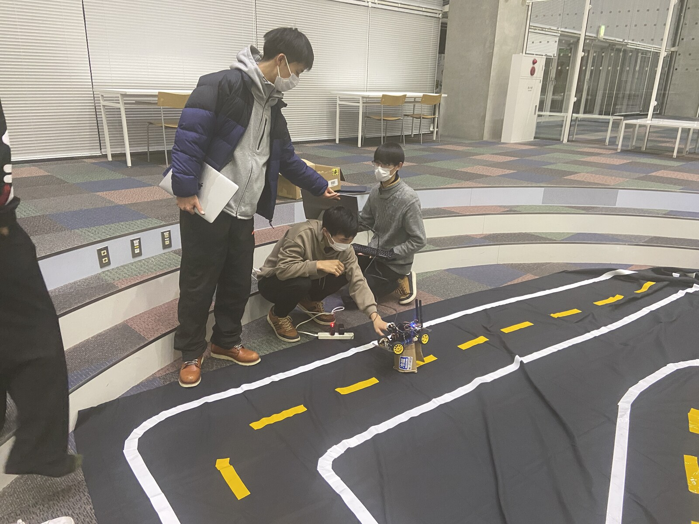
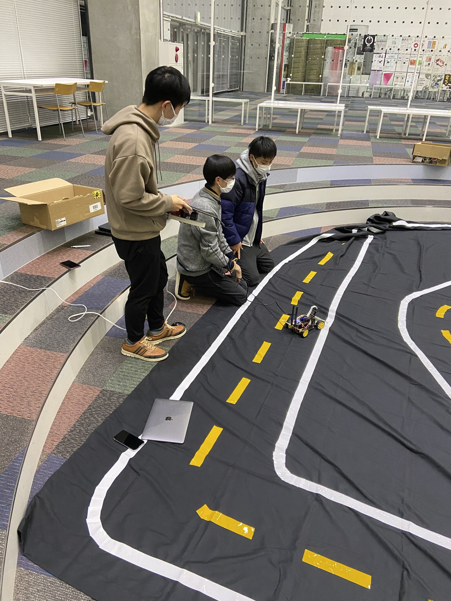
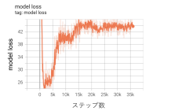

# 世界モデルを用いた自動運転の実現

> [!NOTE]
> このプロジェクトは2022年に実施しました。**ここにあるコードと環境構築に、LLM は使用していません**。開発期間の大半は ChatGPT の一般公開（2022年11月30日）より前で、公開後の期間も使っていません。
>
> この README の整理には GPT を使用しました。記述は、当時のグループ報告書・開発記録・コード・設定ファイルに突き合わせて確認しています。
>
> 公開の目的は情報提供です。私たちがどこで詰まり、何を行い、何が残らなかったかを当時の記録に沿って載せます。
>
> プロジェクト代表/世界モデル班 中村 仁

**世界モデルカー / World Model Car**

| | |
|---|---|
| 大学・科目 | 公立はこだて未来大学 2022年度 システム情報科学実習 |
| プロジェクト | 脳をつくるプロジェクト（22-A）グループ「世界モデルカー」 |
| 期間 | 2022年4月1日から2023年2月25日 |
| メンバー | 中村仁・加藤木敦也・伊藤生慈・黒岩蒼太郎・渡邉悠仁（§11） |
| 技術 | 世界モデル Dreamer V1（PyTorch）× Donkey Car × Jetson Nano |

**English summary**: A 2022 student project at Future University Hakodate: autonomous driving of a Donkey Car (Jetson Nano) using the Dreamer V1 world model (PyTorch). We trained in the DonkeySimLinux simulator, transferred the model to the real car, and ran an on-device data collection and retraining loop. This repository preserves the code, the exact package versions, and every place we got stuck. Full documentation is in Japanese; machine translation should work well on it.

関連リンク:

- [大学のプロジェクトページ](https://www.fun.ac.jp/project/6159/)
- 大学が公開している資料: [グループ報告書](https://www.fun.ac.jp/wp/wp-content/uploads/2022_document22_A.pdf)・[プロジェクト報告書](https://www.fun.ac.jp/wp/wp-content/uploads/2022_project22.pdf)・[ポスター](https://www.fun.ac.jp/wp/wp-content/uploads/2022_poster22_main.pdf)
- 本プロジェクトが公開している資料: [成果発表会スライド（SpeakerDeck）](https://speakerdeck.com/jin_nakamura/noy-wotukurupuroziekuto2022-cheng-guo-fa-biao-hui-suraido-2022nian-12yue-9ri)・[前期のグループ報告書](docs/group_report_22A_first_term.pdf)
- [プロジェクトのサイト（GitHub Pages）](https://jin-research.github.io/MakeBrainProject2022_WorldModelTeam/)（概要と経緯。体制・変遷・当時の話はこちら）

私たちは、世界モデル **Dreamer V1** の PyTorch 実装を使い、ラジコンカーの自動運転に取り組みました。PC 上の DonkeySimLinux で600エピソード学習し、学習済みモデルを Jetson Nano 搭載車へ移しました。

結果を先に書くと、シミュレーション環境でも実環境でも、直線とカーブの両方を走行しました。実機で集めた観測データによる再学習のサイクルも実施しています（§1.3）。

この公開物は、当時の環境をそのまま再現できる完成手順ではありません。残っているコード、設定、版情報、詰まった箇所、解決できなかった箇所を区別して載せます。

## 読みたいものから選ぶ

| 目的 | 行き先 |
|---|---|
| 何をやったかを短時間で知りたい | [サイト（Pages）](https://jin-research.github.io/MakeBrainProject2022_WorldModelTeam/) か [スライド](https://speakerdeck.com/jin_nakamura/noy-wotukurupuroziekuto2022-cheng-guo-fa-biao-hui-suraido-2022nian-12yue-9ri) |
| 同じキットで再現に挑みたい | この README の §2（何が揃っているか）→ §3（機材）→ [docs/SETUP.md](docs/SETUP.md)（手順の全部） |
| コードを読みたい | [sim/](sim/README.md)・[real/](real/README.md)・[car/](car/README.md)（各 README に危険の警告があります） |
| 当時の経緯・体制・判断を知りたい | [docs/ABOUT.md](docs/ABOUT.md) と [docs/ABOUT_appendix.md](docs/ABOUT_appendix.md) |
| 引用・権利を確認したい | §9（ライセンスと上流）と [CITATION.cff](CITATION.cff) |


*シミュレータの観測（左）と、世界モデル側の画像（右）。当時の発表資料の GIF をそのまま収録しています（Step 表示つき・101フレーム）。*


*実車 "Nao" のオンボードカメラ映像（160×120・500フレーム）。報酬と終了判定は、この画像の黄色テープの画素から計算していました（§6）。*

## リポジトリの構成

| 場所 | 中身 | 説明 |
|---|---|---|
| [`docs/SETUP.md`](docs/SETUP.md) | 環境・実行記録の詳細 | 機材、版、当時の操作ログ |
| [`docs/ABOUT.md`](docs/ABOUT.md) ／ [`docs/ABOUT_appendix.md`](docs/ABOUT_appendix.md) | プロジェクトの経緯 | 体制、変遷、判断の流れ |
| [`sim/`](sim/README.md) | シミュレーション学習 | ノートブック＋[改変 `gym-donkeycar`](sim/gym_donkeycar_mods/README.md) |
| [`real/`](real/README.md) | 実機データの学習ノートブック | ⚠ **そのまま実行するとデータを消す箇所あり**（各 README 参照） |
| [`car/`](car/README.md) | Jetson Nano "Nao" のコード28本 | ⚠ **モーターを回すコマンドあり**（[`vendor_mods/`](car/vendor_mods/README.md)＝ベンダ版への改変実物、[`donkeycar_parts/`](car/donkeycar_parts/README.md)） |
| [`env/`](env/README.md) | 当時の requirements 5本 | インストール手順ではなく記録 |
| [`data/`](data/INVENTORY.md) | 走行データの目録 | データ本体は非同梱 |

**危険に関する警告は、各ディレクトリの README に置いています。コードを動かす前に、そのディレクトリの README を必ず読んでください**。

---

## 1. 全体像

### 1.1 学習と実機走行


*グループ報告書 図3.3／図8.1「学習プロセス」*

私たちは、PC でシミュレーション学習とモデル更新を行いました。Jetson Nano "Nao" では、カメラ画像から行動を生成し、車体を動かしてデータを収集しました。

Jetson Nano 単体でモデルを一から作ると、メモリが不足することも確認しました（§3.4）。

```text
【シミュレーション系統・PC】
  Ubuntu 20.04.4 LTS / x86_64
  Python 3.7.0 系
  pyenv + virtualenv
  DonkeySimLinux v18.9
  改変した gym-donkeycar
  Dreamer V1（PyTorch）
  600エピソード学習
          |
          | episode_0600_ の6重み
          v
【実機系統・Jetson Nano "Nao"】
  aarch64 / Python 3.6.8 / CUDA 10.0
  XiaoR GEEK Donkey Car XR-F2 kit
  改造 JetPack 4.2.2
  カメラ画像から steering / throttle を生成
  走行データを収集
          |
          v
【PC】
  reward / done を付加
  モデルを更新
```

PC と Nao は、OS、CPU アーキテクチャ、Python、CUDA、PyTorch の版が異なる別系統の環境でした。

### 1.2 シミュレーション系統と実機系統

| 項目 | シミュレーション系統 | 実機系統 |
|---|---|---|
| 実行機 | GPU 搭載 PC | Jetson Nano "Nao" |
| 環境 | DonkeySimLinux v18.9 | XiaoR GEEK Donkey Car XR-F2 kit |
| Donkey Car | `tawnkramer/gym-donkeycar@4ea670491eaef66178a1ffe3d672c7d4344c51bf` を改変 | `991693552/donkeycar_jetson_nano@0656898c14099f105f82945dd481cc6ce606b103` |
| 観測 | シミュレータの出力を 64×64×3 に設定（当初は 120×160 を OpenCV で縮小）| カメラの120×160画像を Agent の前で64×64へ変換 |
| 行動 | steering / throttle | steering / throttle |
| 主な処理 | 初期学習と評価 | 推論、車体制御、データ収集 |

シミュレータ側の `donkey_env.py` では、`cam_resolution` を `(120, 160, 3)` から `(64, 64, 3)` へ変更しました。`headless=1` も追加しました。

当初はシミュレータが 120×160 で出力し、Dreamer が必要とする 64×64 へ OpenCV で縮小していました。

その後 `cam_resolution` 自体を 64×64 へ変えたため、**このリサイズは同じサイズへの変換になりました**。呼び出しは最終版のノートブックにも残っています（`sim/sim_final.ipynb` に `cv2.resize` が10箇所）。

実機側の `car/config.py` では、カメラ解像度が120×160です。`car/manage2.py` は Agent へ渡す前に64×64へ変換します。


*図3.1 カーキットから組み立てた Donkey Car*


*図3.2 作成したサーキット*





*成果発表会の3日前（2022年12月6日）、会場に敷いたサーキットで実車 "Nao" を調整しているところ。*

### 1.3 結果

**シミュレーション環境でも実環境でも、直線とカーブの両方を走行しました**。

- シミュレーション環境では、600エピソード学習したモデルがサーキットを走行しました。このサーキットには直線とカーブがあります。
- 実環境では、そのモデルを移して十分な速度でサーキットを走行しました。
- 実環境でファインチューニングを重ねた後も、報酬設定の見直しなどにより、**直線・Lカーブ・S字カーブでの自動走行を実現しました**。これにより「自動運転を用いた世界モデルの実環境への応用」を一定のレベルで達成しました。

走行の様子は動画で残しています（Release の Assets に置きます。§2.2 参照）。

一方で、うまくいかない試行もありました。

- ファインチューニングを重ねた後は、シミュレーション環境で作ったモデルほどの速度は出ませんでした。
- カーブに対処できずコース外へ進むことがありました。ファインチューニングの試行回数は一桁と少なく、検証は課題として残りました。

シミュレーション学習では、model loss が500エピソード（約5万ステップ）付近から概ね収束しました。下の図の横軸はステップ数です。


*図4.1 VAE による再構成*


*図4.2 model loss*

シミュレータ内の別環境へファインチューニングしたモデルは、**その環境でも適切に自動走行しました**。観測データの再構成も概ね適切でした。

一方で、約50エピソードを超えたあたりで KL loss が急増しました。原因はファインチューニングに用いた環境が複雑だったためと考えましたが、**修正には至りませんでした**。


*図4.3 ファインチューニング後の VAE による再構成*



*図4.4 ファインチューニング後の model loss*


*図4.5 ファインチューニング後の kl loss*

---

## 2. 揃っているもの／欠けているもの

この節は、公開物を読むときの基準です。

### 2.1 このリポジトリに揃っているもの

- シミュレーション側の最終ノートブック `sim/sim_final.ipynb`。
- 実車データ処理側の最終ノートブック `real/real_final.ipynb`。
- 改変済み `gym-donkeycar` のうち、変更した `envs/` の2ファイル系統（`donkey_sim.py` の4版と `donkey_env.py`）。`sim/gym_donkeycar_mods/` に、改変前の `donkey_sim_original.py`、中間の2版、最終 `donkey_sim.py`、`donkey_env.py`、および差分を置いています。
- 実機用コード `car/` 28本。
- Nao で使った設定を公開用に置いた `car/config.py`。
- `env/` に置いた5環境の freeze ファイル。
- グループ報告書 `docs/group_report_22A.pdf` と報告書から取り出した図。
- 実機走行データの目録 `data/INVENTORY.md`。当時の台帳 `real_data_names_store.txt` の実物を同梱しています（10本すべて 2022年12月9日）。

次はファイル本体が残っていないため、内容を [docs/SETUP.md](docs/SETUP.md) に載せています。

- Jassy 用の PyTorch 自前ビルドに使った `torch.sh` の内容と実行履歴。
- 改造 JetPack の配布 URL、分割ファイル名、書込みツール。
- `fdisk` のキー操作と `resize2fs /dev/mmcblk0p1` の実ログ。

改変済み `gym-donkeycar` について、上流コミット `4ea670491eaef66178a1ffe3d672c7d4344c51bf` からの変更行数は次のとおりです。

| 版 | 更新日時 | 上流比 |
|---|---|---:|
| `donkey_sim_original.py` | 2022-10-21 | 35行 |
| `donkey_sim_archive_reward_1021.py` | 2022-10-22 | 88行 |
| `donkey_sim_.py` | 2022-10-26 | 107行 |
| `donkey_sim.py`（最終） | 2022-10-31 | **109行**（追加102・削除7） |

`donkey_sim_original.py` は「私たちが報酬を書き換える前」のスナップショットであり、上流そのものではありません。この時点で既に35行が変わっています（デバッグ用 print、`calc_reward` の複製を `"""` で囲んだもの、`img_w`／`img_h` の既定値を `0` から `64` へ変更、空白）。

10/21 のスナップショットから最終版までの差は77行追加・7行削除です。詳しくは [sim/gym_donkeycar_mods/README.md](sim/gym_donkeycar_mods/README.md) を見てください。

### 2.2 手元にあるが、このリポジトリには含めていないもの

100エピソードごとの6モデルと、実機へ載せた `episode_0600_` の6ファイルは手元にあります。`*.pth` は大容量成果物としてこのリポジトリには含めていません。公開リポジトリでは `.gitignore` で `*.pth` を除外します。

```text
episode_0600_/encoder.pth
episode_0600_/rssm.pth
episode_0600_/obs_model.pth
episode_0600_/reward_model.pth
episode_0600_/value_model.pth
episode_0600_/action_model.pth
```

学習済み重み（実機に載せた `episode_0600_` の6ファイル）は、**この GitHub リポジトリの Release の Assets** に置きます。

そのほか、手元にあるが含めていないものは次のとおりです。

- `.pth` の各 Tensor を分割した **64個の `.npy`**（`.gitignore` で除外）
- **実機の走行データ 10本の pickle**（1本80MB超あり。目録は [`data/INVENTORY.md`](data/INVENTORY.md)）
- 改変後のファイルは [`car/vendor_mods/`](car/vendor_mods/) にあります（作業ツリーの全体は非同梱）

走行の動画と、当時ビルドした wheel 2本（torch 1.9.0a0・tensorflow 2.6.0 の aarch64 版）も **Release の Assets** に置きます。走行データ（pickle 10本）は容量が大きいため、このリポジトリには置いていません。走行データのファイル名の一覧は [data/INVENTORY.md](data/INVENTORY.md) にあります。

### 2.3 再現の壁になるもの

同じキットで再現しようとすると、次の2つで止まります。

- **実機系統は、改造 JetPack の入手で止まります**。私たちにはその再配布も、入手先 URL の掲載もできません（§3.5）。シミュレーション系統には、この制約はありません。
- **Python 3.7 環境は、当時と同じ手順では作り直せません**。`env/` の requirements は当時の freeze であり、インストール手順ではありません。前身の環境（`py3.6.9`・`py3.7.0`）をどう作ったかは [docs/SETUP.md](docs/SETUP.md) §2.5 に書いています。

そのほか、次の点は当時のログが残っていません。

- swap を作るときの実コマンド（結果は §7.2 に書いています）
- NVIDIA ドライバを入れた apt のコマンド列
- Nao の `i2cdetect` 出力と、説明付きの配線図（I2C のバス番号は当時から解決できないままでした）
- 実機の緊急停止手順

---

## 3. 機材と環境

### 3.1 車体と周辺機器

価格とリンクは2022年当時の購入記録に残っていたものです。リンク先は現在では変わっている場合があります。

#### 購入したもの

| 品名 | 型番・仕様 | 注文日 | 価格 | 当時のリンク |
|---|---|---|---:|---|
| XiaoR GEEK Donkey Car XR-F2 for Nvidia Jetson nano kit | Amazon `B096MFLZ91` | 2022-05-13（納品 06/14〜22） | 78,900円 | [Amazon](https://www.amazon.co.jp/dp/B096MFLZ91/) |
| SD カード | SanDisk Extreme `SDSDXV5-128G-GHENN`、128GB SDXC Class 10、UHS-I U3、V30。**フルサイズ SD** | 2022-05-27 | 3,680円 | [Amazon](https://www.amazon.co.jp/dp/B07XP3GPC3) |
| 無線LAN子機 | TP-Link `TL-WN725N`、11n/11g/b デュアルモード | 2022-05-27 | 727円 | [Amazon](https://www.amazon.co.jp/dp/B008IFXQFU) ／ [メーカー](https://www.tp-link.com/jp/home-networking/adapter/tl-wn725n/) |
| 小型 WiFi | BUFFALO `WMR-433W2-BK`（USB 無線LAN親機・トラベルルーター）。当時の記録は品名のみで、型番はリンク先による | - | - | [Amazon](https://www.amazon.co.jp/dp/B07R2CKQXC) |
| カメラ | SainSmart IMX219、8MP、160度 FoV、3280×2464（NVIDIA Jetson Nano 用） | - | - | - |

#### 借りたもの・すでに持っていたもの

| 品名 | 型番・仕様 | 個数 | リンク |
|---|---|---:|---|
| GPU 搭載ノート PC | ROG Zephyrus G15 GA503QR（GeForce RTX 3070） | 1 | [RTX 3070 製品ページ](https://www.nvidia.com/ja-jp/geforce/graphics-cards/30-series/rtx-3070-3070ti/) |
| JETSON NANO DEVELOPER KIT | - | 1 | [NVIDIA](https://developer.nvidia.com/embedded/jetson-nano-developer-kit) |
| AC アダプター | SUCCUL 5V 4A | 1 | [Amazon](https://www.amazon.co.jp/dp/B015RKFAA2) |
| microSD | SanDisk `SDSQUA4-128G-EPK` | 1 | [Amazon](https://www.amazon.co.jp/dp/B08K41Q79R) |
| Raspberry Pi Camera V2 | - | 2 | - |
| Raspberry Pi 4 スターターキット | Traskit | 2 | [Amazon](https://www.amazon.co.jp/dp/B08HVLB5GZ) |
| ブレッドボード | ELEGOO Solderless Breadboard Kit | 1 | [メーカー](https://www.elegoo.com/products/elegoo-solderless-breadboard-kit) |
| ジャンパー線 | 雌〜雌 15／雄〜雌 9／雄〜雄 17 | - | - |
| モバイルバッテリー | 当時のリンクは現在切れています | - | - |

#### 検討したが購入しなかったもの

| 品名 | リンク |
|---|---|
| Intel 8265（無線LAN）※購入品リストにも記録があり、最終形は特定できません | [Amazon](https://www.amazon.co.jp/dp/B01KT3VI7Q) |
| microSDXC 128GB SanDisk Extreme UHS-1 U3 V30 4K Ultra HD A2対応 | [Amazon](https://www.amazon.co.jp/dp/B082WP62DV) |

無線は Intel 8265（M.2）と USB ドングルの両方が記録に出てきます。当時の記録には「ドングルとIntel8265の違い➡️スピード、安定性(やってることは一緒)」とあります。

キットには、車体、Jetson Nano、DCモーター、サーボモーター、カメラ、モータードライバーを含む拡張ボードがありました。

一部の部品は寸法が合わず、工房で削って組み立てました。

### 3.2 コース材料

| 材料 | 品番・寸法 | 記録額 |
|---|---|---:|
| 黒い背景布 | 3m×6m | 3,810円 |
| 白色テープ2ロール | ニトムズ 布粘着テープSE `J5445` | 766円 |
| 黄色テープ | ニトムズ カラー布粘着テープSE `J5442`、50mm×25m | 284円 |
| **合計** |  | **4,860円** |

当時の記録には、別案として `黒 300 x 360`（3m×3.6m）3,260円 も並記されています。合計 4,860円 に入っているのは 3m×6m の方です。

参考にしたのは [DIYRobocars Standard Track](https://robocarstore.com/products/diyrobocars-standard-track) です。制作期間はおよそ1日でした。

コースは、3m×6m の背景布1枚の上に作りました。線幅はテープの幅と同じ50mmです。

線の色と報酬の関係は §6.1 にまとめています。


### 3.3 学習用 PC

| 項目 | 当時確認した値 |
|---|---|
| PC | ROG Zephyrus G15 GA503QR（型番は当時の端末記録のホスト名による）|
| CPU | Ryzen 9 |
| GPU | GeForce RTX 3070 |
| GPU メモリ表示 | 8192 MiB |
| OS | Ubuntu 20.04.4 LTS |
| カーネル / アーキテクチャ | 5.15.0-41-generic / x86_64 |
| GPU ドライバ | 510.73.05（2022-06-17 時点）|
| `nvidia-smi` の CUDA 表示 | 11.6 |
| `nvcc -V` | CUDA Toolkit release 11.1, V11.1.74（2022年6月時点は 11.5, V11.5.119）|
| Python | 3.7.0 系 |
| 最終的な環境管理 | pyenv + virtualenv |
| Dreamer / RL 環境 | `rl3.7.0` |
| シミュレータ環境 | `sim3.7.0` |
| conda 配布物 | Miniforge。pyenv と併存した記録あり |

`nvidia-smi` の実出力（2022年6月17日）で確認できたのは次の値です。

```text
NVIDIA-SMI 510.73.05    Driver Version: 510.73.05    CUDA Version: 11.6
NVIDIA GeForce ...      5MiB / 8192MiB
```

`nvidia-smi` の CUDA 11.6表示はドライバ側の対応版で、`nvcc -V` の CUDA Toolkit 11.1が実際に入れた版です。この2つは別の値です。

環境スナップショットは `env/` の5ファイルに分けています。これらは当時の証拠であり、そのまま `pip install -r` に渡すインストール手順ではありません。

| ファイル | 環境 |
|---|---|
| `env/requirements-rl3.7.0.txt` | PC・Dreamer |
| `env/requirements-sim3.7.0.txt` | PC・シミュレータ |
| `env/requirements-rl3.7.0-freeze.txt` | PC の追加 freeze |
| `env/requirements-jetson-nao.txt` | Nao |
| `env/requirements-jetson-jassy.txt` | Jassy |

### 3.4 Jetson Nano の機体と JetPack

| 機体 | JetPack | Donkey Car / 駆動 | PyTorch |
|---|---|---|---|
| **Nao** | 4.2.2 | XiaoR ベンダ版2.5.8と `actuator.so` | stock `1.1.0a0+b457266` |
| **Jassy** | 4.6.2 | `ari-viitala/donkeycar` と PCA9685 | 自前ビルド `1.9.0a0+gitd69c22d`、cp37 |
| **Chaos** | 4.6.1 | - | - |

最終的に走行した実機は Nao です。

**Chaos は別の機体ではありません**。当時の記録に「nao の jetpack バージョンを jassy の方に合わせるように新たにフラッシュしたもの」（2022-11-22）とあり、Nao を Jassy の JetPack 版へ合わせて焼き直した状態に付けた呼び名です。この試みは「保留」のまま終わり、最終的に走行したのは JetPack 4.2.2 の Nao です。

cp37 の自前ビルド PyTorch は Jassy の記録です。Nao の Python 3.6.8と組み合わせたものではありません。

Nao の基本構成で確認できたのは次のとおりです。

| 項目 | 値 | 出所 |
|---|---|---|
| SoC アーキテクチャ | aarch64 | 当時の環境記録 |
| Python | 3.6.8 | グループ報告書 |
| CUDA | 10.0 | グループ報告書 |
| JetPack | 4.2.2（`nvidia-l4t-core` = `32.2.1-20190812212815`） | 実機での `dpkg-query` 出力 |
| microSD | 128GB。`fdisk` の表示は `Disk /dev/mmcblk0: 119.1 GiB, 127865454592 bytes` | 当時の操作ログ |
| ルートパーティション | 拡張後 `/dev/mmcblk0p1` が 118G（使用13G・空き101G・11%） | `df` の実出力 |
| swap | 2GB から 18GB へ拡張。最終ファイル名は `swapfile2` | 当時の操作ログ |

> [!NOTE]
> Jetson Nano のスロットは **microSD** です。購入記録の `SDSDXV5-128G-GHENN` は**フルサイズ SD** なのでそのままでは挿さりません。借用記録には microSD の `SDSQUA4-128G-EPK`（128GB）があります。同じキットで再現する場合は **microSD の 128GB** を用意してください。

Jetson Nano のメモリは 4GB です。搭載していた JetPack 4.2.2（L4T 32.2.1）が 2GB 版に対応していないためです。

私たちは、「Jassy 版」だけでモデルを一から作るとメモリが不足することを確認しました。そのため PC で学習し、Jetson Nano では推論とデータ収集だけを行いました。swap を 18GB まで広げたのは、実機側で大きなパッケージを入れたり長時間の処理を走らせたりするためです。

Nao の最終 `car/config.py` に残る PWM 値は次のとおりです。これらはベンダ既定値のままで、実測較正値ではありません。

| 項目 | 値 |
|---|---:|
| `DRIVE_LOOP_HZ` | 20 |
| `MAX_LOOPS` | 100000 |
| `CAMERA_RESOLUTION` | `(120, 160)` |
| `STEERING_CHANNEL` | 1 |
| `STEERING_LEFT_PWM` | 40 |
| `STEERING_RIGHT_PWM` | 150 |
| `THROTTLE_CHANNEL` | 0 |
| `THROTTLE_FORWARD_PWM` | 200 |
| `THROTTLE_STOPPED_PWM` | 100 |
| `THROTTLE_REVERSE_PWM` | 0 |

本家 `autorope/donkeycar` の既定値とは違う値です。当時の記録に本家の `config.py` の控えが残っています。

| 項目 | 本家 `autorope/donkeycar` | Nao（XiaoR ベンダ版） |
|---|---:|---:|
| `STEERING_LEFT_PWM` | 460 | **40** |
| `STEERING_RIGHT_PWM` | 290 | **150** |
| `THROTTLE_FORWARD_PWM` | 500 | **200** |
| `THROTTLE_STOPPED_PWM` | 370 | **100** |
| `THROTTLE_REVERSE_PWM` | 220 | **0** |
| `PCA9685_I2C_ADDR` | `0x40` | **記載なし** |
| `PCA9685_I2C_BUSNUM` | `None`（自動検出） | **記載なし** |

本家は PCA9685 を前提にした値です。Nao はベンダ版 Donkey Car で、`actuator.so` が駆動を担うため PCA9685 の設定自体がありません。

本家の `config.py` では、各 PWM 値に次のコメントが付いています。

```text
use `donkey calibrate` to measure value for your car
```

**車体ごとに測る前提の値**ということです。同じキットを買った人は、自分の車体で測り直してください。

### 3.5 Nao の改造 JetPack

Nao の microSD には、記録された Drive フォルダから取得した改造 JetPack を使いました。

- 配布ファイル: `JetsonNanoDonkey.part1.rar`
- 配布ファイル: `JetsonNanoDonkey.part2.rar`
- 私たちは、当時これが Google Drive に再アップロードされているのを見つけて使いました。**その URL はここには載せません**。第三者のフォルダであり、私たちに再配布する権利がないためです（`NOTICE` 参照）
- 書込みツール: USB Image Tool

2つの分割ファイルを展開し、`.img` を得ました。その後、JetPack 4.2対応の Jetson Nano Developer Kit SD card image を適用しました。

128GB の microSD へのフラッシュは、メモリと依存関係で失敗するたびに初期化し、5、6回やり直しました。一度で決まらなかったため、この工程には時間を見ておく必要があります。

何度もフラッシュした後、使用状態へ到達するまで約1週間かかりました。

---

## 4. 当時の処理順

この節は、当時どの順で処理していたかを復元したものです。コピペして動かせる実行手順ではありません。

### 4.1 シミュレーション側

| 順番 | 当時の処理 | 現在分かっていること |
|---:|---|---|
| 1 | DonkeySimLinux v18.9をPCへ展開 | x86_64用です。Jetson Nanoでは `Exec format error` になりました |
| 2 | `tawnkramer/gym-donkeycar@4ea670491eaef66178a1ffe3d672c7d4344c51bf` を基準にした改変版を使用 | 改変版は `sim/gym_donkeycar_mods/` にあります |
| 3 | `donkey_env.py` の観測を64×64×3へ変更 | `headless=1` も追加しました |
| 4 | `donkey_sim.py` の reward と done を色ベースへ変更 | CTE 超過と衝突による標準処理は使いませんでした |
| 5 | `sim/sim_final.ipynb` のシミュレータ実行パスを展開先に合わせて変更 | ノートブック側の元の絶対パスはプレースホルダへ置き換えています |
| 6 | ノートブックのセル順に初期データ収集、Dreamer 学習、評価、保存を実施 | ノートブックには Jupyter magic、対話入力、セル間状態があります |
| 7 | 100エピソードごとに6モデルを保存 | 基本学習量は600エピソードです |

主な学習設定は次のとおりです。

| 項目 | 値 |
|---|---:|
| 観測 | RGB 64×64 |
| 行動 | steering / throttle の2次元 |
| Encoder 出力 | 1024 |
| `state_dim` | 30 |
| RNN hidden | 200 |
| Transition hidden | 200 |
| Reward / Value hidden | 400 |
| Action hidden | 400 |
| Replay Buffer capacity | 300,000 |
| Model learning rate | `6e-4` |
| Value learning rate | `8e-5` |
| Action learning rate | `8e-5` |
| Adam epsilon | `1e-4` |
| Seed episodes | 5 |
| All episodes | 600 |
| Test interval | 10 |
| Save interval | 100 |
| Updates per collected episode | 100 |
| Action noise variance | 0.3 |
| Batch size | 50 |
| Chunk length | 50 |
| Imagination horizon | 15 |
| `gamma` | 0.9 |
| `lambda` | 0.95 |
| Gradient clipping | 100 |
| `free_nats` | `1e-7` |
| 1エピソードの上限 | 2,000 step |

TensorBoard の連携コードはノートブックに残っていますが、出力された events ログ本体はありません。

当時の記録には、`base_all_square_pixel_percentage = 10` で実験したときの開始時刻が2つ残っています。

```text
開始時刻： 2022-10-29 18:52:29.372176+09:00
開始時刻： 2022-10-30 12:21:34.592916+09:00
```

この2つは約17.5時間離れていますが、**これが1回の600エピソード学習に要した時間であるとは記録に書かれていません**。2回の実行の開始時刻という読み方もできます。所要時間の根拠としては使えません。

### 4.2 PC と実機の往復

| 順番 | 当時の処理 | 現在の状態 |
|---:|---|---|
| 1 | PCで6個の `.pth` の各 Tensor を `.npy` に分割 | 64個の `.npy` が手元に残っています。本リポジトリには含めていません |
| 2 | `.npy` 群をJetson Nanoへ転送 | SSH 経由で送りました |
| 3 | Jetson Nano側のPyTorchで `.npy` 群を6個の `.pth` へ復元 | 当時使った `car/pull_weight.py` を同梱しています |
| 4 | `manage2.py` で推論、走行、画像・steering・throttle の収集 | 公開版は不足 import により起動前に停止します |
| 5 | `gets_reward_done_independent.py` で reward と done を追加 | 元の `.bin` を同名で上書きします |
| 6 | `train_world_model.py` でモデルを更新 | 現存版はそのままでは動きません |
| 7 | 更新した重みを `.npy` 経由で実機へ戻す | 変換ツールは両方向とも同梱しています（往路は `real/real_final.ipynb` 内のセル、復路は `car/pull_weight.py`）|

PC と Jetson Nano の PyTorch 版が異なったため、当時は `.pth` を直接移す代わりに `.npy` を経由しました。

PC 側の `.npy` は次の6ディレクトリに分かれています。

```text
tmp_action/
tmp_encoder/
tmp_obs/
tmp_reward/
tmp_rssm/
tmp_value/
```

変換元コードには `os.mkdir(..., exist_ok=True)` という無効な呼出しがあります。標準 Python の `os.mkdir()` は `exist_ok` を受け取りません。

当時の `pull_weight.py` には、action 重みを `action.pth` として出す版と、`action_model.pth` として出す版がありました。`car/manage2.py` が要求する名前は `action_model.pth` です。

同梱したのは `action_model.pth` を出す版です。2版の差はこの1行だけでした。

私たちは ONNX も試した上で、`.npy` 経由を採用しました。

### 4.3 `car/manage2.py` の起動前条件

> [!CAUTION]
> `car/manage2.py` は、ベンダ版 Donkey Car に**存在しない**シンボルを2つ import します。両方を配置しないと起動できません。
>
> 1. `:16` `from donkeycar.parts.camera import CSICamera`。私たちが追加したクラスです。[`car/vendor_mods/parts/camera.py`](car/vendor_mods/parts/camera.py) をベンダ版の `donkeycar/parts/camera.py` と置き換えてください。
> 2. `:20` `donkeycar.parts.datastore_for_record`。[`car/donkeycar_parts/datastore_for_record.py`](car/donkeycar_parts/) を `donkeycar/parts/` へ置いてください。
>
> **先に止まるのは16行目の `CSICamera` です**。片方だけ配置しても起動しません。

不足モジュールを別途復元した後は、当時の配置で次の6ファイルを要求します。

```text
mycar/presentemp/encoder.pth
mycar/presentemp/rssm.pth
mycar/presentemp/obs_model.pth
mycar/presentemp/reward_model.pth
mycar/presentemp/value_model.pth
mycar/presentemp/action_model.pth
```

この6ファイルも本リポジトリには含めていません。

なお `car/pull_weight.py` は6本の `.pth` を**カレントディレクトリ**に出力します。`manage2.py` が読むのは `./presentemp/` なので、生成した6本を `presentemp/` へ移してから起動します。

`manage2.py` は、6モデルを作成して重みを読み、`MyController`、CSIカメラ、TubWriter、steeringとthrottleのアクチュエータをVehicleへ登録する構成です。

> [!CAUTION]
> `manage2.py` には起動前の arm スイッチと安全確認がありません。緊急停止手順の記録も残っていません。停止方法を決めるまで実車で起動せず、車輪を接地しない試験から確認する必要があります。
>
> **`car/manage.py` も同じです**。`manage.py:108,112` が `PWMSteering` と `PWMThrottle` を車両ループへ組み込むため、`manage.py drive` 系の起動も実際にモーターを回します。試す前に車輪を浮かせてください。

---

## 5. そのままでは動かないコード

この節のノートブックの行番号（例 `sim/sim_final.ipynb:1299`）は、ファイルを **raw JSON として開いたときの行**です。Jupyter で開いた場合は行番号では辿れないので、併記したコード片で検索してください。

この節は `car/` のスクリプトと、**同梱ノートブック2本**（`sim/sim_final.ipynb`・`real/real_final.ipynb`）の両方を対象にします。ノートブックにもそのまま実行するとデータを失う箇所があります（§5.10 参照）。

### 5.1 `car/manage2.py`

- 起動前の不足モジュール2本と配置は §4.3 のとおりです。
- 同じ画像に対して Agent を2回呼びます。Agent は呼出しごとに RNN 隠れ状態を更新するため、1フレームで内部状態が2ステップ進みます。
- 画面へ表示する action と、実際の制御に使う action が別になります。
- 2つ目の TubWriter は `recording` を要求しますが、それを出力する part がありません。
- カメラ出力名 `image` と要求名 `image_array` が一致しません。
- 画面には `CTRL+S` と表示しますが（`car/manage2.py:93,137`）、Ctrl+S を扱うコードは `car/` 内にありません。実際の停止操作は当時の記録では Ctrl+C です。なお終了時の保存は `V.start()` の内部で行われます。改変版 `vehicle.py` を [`car/vendor_mods/vehicle.py`](car/vendor_mods/vehicle.py) に同梱しており、`:128` の `except KeyboardInterrupt:` で確認できます。
- コメントには20秒走行とあります。実際の `car/config.py` は20Hz、最大100000ループです。上限までなら約83分20秒です。
- 実機でも ActionModel の既定 `training=True` により確率的 sample を使います。
- ベンダ版へ組み込む改変 `vehicle.py` の dead 判定は、コース逸脱を検知すると **走行を15秒間止めます**（`car/vendor_mods/vehicle.py:205-208` の `for i in range(15): time.sleep(1)`。詳細は [`car/vendor_mods/README.md`](car/vendor_mods/README.md)）。

### 5.2 `car/train_world_model.py`

現存ファイルには、少なくとも次の問題があります。

- `lambda_target()` を import せずに呼びます。
- action model の保存先に使う `model_log_dir` が未定義です。
- データ名一覧をループしても、毎回同じ固定 `.bin` を開きます。
- **EOF に達するとデータファイルを削除します**（`car/train_world_model.py:157` の `os.remove`）。
- その後、`wb` で開いた書込み専用ファイルから `pickle.load()` しようとします。
- Optimizer を作った後にモデルを別インスタンスへ作り直します。Optimizer は古いモデルを保持します。
- Replay Buffer は画像領域だけで約3.43GiBを確保する設定です。
- import する `car/dreamer/replaybuffer.py:18` の `ReplayBuffer` が `np.bool` を使います（`self.done = np.zeros((capacity, 1), dtype=np.bool)`）。新しい NumPy では削除されている別名です。

このファイルを実データに使わないでください。修正後は、複製したデータで検証してから扱う必要があります。

### 5.3 `car/pthToOnnx.py`

`car/pthToOnnx.py:14` には、`torch.onnx.export(model = PATH = "...", dummy_input, ...)` という呼出しがあります。

引数内で連鎖代入しているため構文エラーになります。ファイル自体を parse できません。

### 5.4 `car/dreamer/main.py`

`car/dreamer/main.py:43` は `obsercation` を import します。実ファイル名は `observation.py` です。

この名前の不一致により ImportError になります。

### 5.5 `car/dreamer/makeEnv.py`

`car/dreamer/makeEnv.py:2` のコンストラクタは `def __init__():` となっており、`self` がありません。

以降の処理も `self.` を付けずに値を参照しています。このままではインスタンスの状態を保持できません。

### 5.6 `car/gets_reward_done.py`

このファイルは、**単体では動きません**。冒頭で外部モジュールから処理対象のファイル名を受け取る作りだからです。

```python
from donkeycar.real_data_names_store import datafilename
```

`car/gets_reward_done.py:4` のこの行が、`__init__` の読み込みと `save_pickle` の書き出しの両方で使う `datafilename` を供給しています。`real_data_names_store` は改変版 Donkey Car 側にあります。[`car/vendor_mods/real_data_names_store.py`](car/vendor_mods/real_data_names_store.py) に同梱しました（8行）。

`save_pickle` の中には、ファイル名をその場で組み立てる行が残っていますが、コメントアウトされています。

```python
def save_pickle(self):
    #datafilename = "./data/" + str(datetime.datetime.now(...)) + "5data.bin"

    with open(datafilename,"wb") as f:
```

> [!CAUTION]
> 読み込みと書き出しが**同じ `datafilename`** です。実行すると元の `.bin` を上書きします。

**このファイルは1個の `.bin` を扱う版です**。最終版の `car/gets_reward_done_independent.py` は、`datafilename` を引数で受け取り、`real_data_names_store.txt` の一覧をループして処理します。外部モジュールに依存しないので、**再利用するならこちらを使ってください**。なお `car/gets_reward_done_independent.py:118` には `index_min = min(len(steerings), len(throttles), len(images))` がありますが、**この値はどこでも使われていません**。直後の `pickle.dump` は3つのリストを丸ごと書き出します。長さを揃えたい場合は、呼び出す側で切り詰める必要があります。

### 5.7 正しく書けている例

`car/pkl.py:14-17` は、`real_data_names_store.txt` の一覧をループし、**ループ変数をそのまま開いています**。

```python
for filedataname in l_strip:
    with open(filedataname, mode="rb") as f:
```

`car/train_world_model.py` は同じ一覧をループしながら固定のファイル名を開きます（§5.2）。

### 5.8 データと重み

- `gets_reward_done_independent.py` は元の `.bin` を `wb` で同名上書きします。別名または別ディレクトリへバックアップしてから扱う必要があります。
- 車上で保存した pickle と、reward / done追加後の pickleでは項目数が異なります。
- 当時の `.pth` → `.npy` 変換コードには、標準 Python では無効な `os.mkdir(..., exist_ok=True)` があります。
- `pickle.load()` は信頼できるファイルだけに使う必要があります。

### 5.9 4種類のスロットル変換

現存コードとノートブックでは、スロットル変換が4種類に分かれています。

| 場所 | 用途 | 式 |
|---|---|---|
| `sim/sim_final.ipynb:1299,1391` | シミュレータの初期データ収集 | `(action[1] + 0.75) / 2` |
| `sim/sim_final.ipynb:1571,1808,1832` ／ `real/real_final.ipynb:1769,1793` | 訓練中のテストと burn-in | `(action[1] + 0.75) / 2` |
| `sim/sim_final.ipynb:1761` ／ `real/real_final.ipynb:1722` | 独立した評価セル | `(action[1] + 0.75) / 4` |
| `car/manage2.py` | 実機駆動 | `(action[1] + 0.75) / 8` |
| 実機データの学習投入処理 | Replay Bufferへ投入 | `(throttles[i] + 0.75) / 16` |

`training=False` のループは他にもあり、そちらは `/2` です。`/4` は独立評価セルの2箇所だけで、どちらも生きています。

実機で記録する throttle は、すでに `/8` の変換後です。その値へ学習投入時の `/16` をさらに適用するコードは、PC 側の action 空間と一致しません。

再利用する場合は、ActionModel の出力、評価時の値、実機 PWM、pickle の保存値、Replay Buffer への入力で規約を1つに決めてください。

### 5.10 `real/real_final.ipynb`（同梱ノートブックの危険箇所）

> [!CAUTION]
> **このノートブックは、読み込んだ pickle ファイルを削除することがあります。必ず複製に対して実行してください**。
> 実機データを読むセルは、`pickle.load()` が `EOFError` になったときに `os.remove(data)` で入力ファイルを削除し、
> 同じ名前を `"wb"` で開き直します（raw JSON の `real/real_final.ipynb:1232` 付近。検索語: `os.remove`）。
> 走行データが途中で切れていた場合、元のファイルは失われます。

> [!WARNING]
> 重み変換のセルには `os.mkdir(tmp_name, exist_ok=True)` が6箇所あります（検索語: `exist_ok`）。
> 標準の `os.mkdir()` は `exist_ok` を受け取らないため `TypeError` になります。`os.makedirs()` が正しい形です。

詳しくは [`real/README.md`](real/README.md) を見てください。`sim/sim_final.ipynb` 側の注意は [`sim/README.md`](sim/README.md) にあります。

---

## 6. 報酬と終了条件

### 6.1 色ベースの報酬

私たちは、gym-donkeycar の CTE ベースの報酬を使いませんでした。`self.cte > self.max_cte` と衝突時の負報酬をコメントアウトし、指定色の画素割合と速度を使う式へ置き換えました。

```text
reward =
  (all_square_pixel_percentage / 5)
  × (speed / 10)
```

実機データへ reward を後付けする処理では、`speed` に相当する値として throttle を使います。steering は式に入りません。

done のフレームでは `reward = -1.0` としました。

`base_all_square_pixel_percentage` は探索中に2、10、5と変わり、最終値は5です。

報酬に使う基準 RGB は R:210–240、G:170–200、B:110–140 です。これは**シミュレータの路面色 `#ECBC79`**（R=236, G=188, B=121）を囲む範囲です。

実環境のテープから取ったサンプルは `#eaa004`（R=234, G=160, B=4）と `#fccc54`（R=252, G=204, B=84）で、**上の範囲には入りません**。当時の記録にも「結構違うので別々にする」とあります。

実機側では `extention_color=10` で各範囲を上下へ10広げました。なぜ10なのかの理由は記録に残っていません。当時のメモに残るのは「結構違うので別々にする」という判断だけです。

10広げても、上の2色は範囲に入りません。実環境で実際にどの画素が拾われていたかは、走行データの画像から確かめられます（目録は [data/INVENTORY.md](data/INVENTORY.md)）。データ本体は容量の都合で同梱していません。

#### この報酬の限界

当時、**影がかかった黄色テープの色も測っています**。

| サンプル | R | G | B | 基準範囲に入るか |
|---|---:|---:|---:|---|
| `#836916` | 131 | 105 | 22 | **入らない** |
| `#826600` | 130 | 102 | 0 | **入らない** |

基準は R:210–240、G:170–200、B:110–140 なので、影の下ではテープを認識できません。
`extention_color` で上下へ10広げても届きません。

**この報酬は、照明条件に依存します**。同じコースでも影の位置が変われば、拾える画素が変わります。
同じ方式を使う場合は、照明を一定にするか、色以外の手がかりを足す必要があります。

### 6.2 終了条件

終了条件も CTE 版から差し替えました。

1. 指定色の画素割合を計算します。
2. 割合が0.1%未満なら `count_to_dead` を1増やします。
3. `count_to_dead` が30に達すると終了します。
4. 終了時に `count_to_dead` を0へ戻します。
5. 色が戻った場合は、`count_to_dead > 5` のときだけ5を引きます。

`count_to_dead` は初期化時と reset 時の2箇所で0.0へ戻します。

正常なフレームが途中に入っても、カウンタは条件に従って5ずつだけ減ります。このため、30フレームが完全に連続する条件ではありません。

#### この閾値をどう決めたか

出発点は `ari-viitala/donkeycar` の `is_dead` でした。画面の下側を切り出して**黒い画素**を数え、一定数を下回ったらコース外と判定する方式です。

```python
crop_height = 20
crop_width = 20
threshold = 70
pixels_percentage = 0.10
```

私たちは、これを**指定色の画素割合**に置き換えました。実環境でも同じ計算ができるようにするためです。

最初の閾値は次のように決めました。当時の記録から引きます。

> 15ループごとに情報を撮ってきている。
> だいたい、道を外れてから15\*8くらいたったらkillでよいのかなと思うが、
> 実際の環境ならもう少し猶予を与えても良さそうなので、15\*10にしてみる

つまり `15*10 = 150` から始めています。最終版の `15*2 = 30` は、そこから下げた値です。

`base_all_square_pixel_percentage` は 2 から始め、10 で実験し、最終的に 5 にしました。2 のときは報酬が 1 を超えることがあり、当時の記録には「報酬が多少でかいように感じる」「0〜1にする必要がある。そうでないとインフレ起こす」とあります。

### 6.3 ピクセル割合の分母

シミュレータ側と実機側は、次の式を使っています。この式は最終版ファイルの中に **6ファイル・10箇所**あります: `sim/gym_donkeycar_mods/donkey_sim.py:476,634`、`car/gets_reward_done.py:47,81`、`car/gets_reward_done_independent.py:49,83`、`real/real_final.ipynb`（2箇所）、**実車で毎ループ走る dead 判定 `car/vendor_mods/vehicle.py:191`**、および `car/dreamer/action.py:40`（参照する属性が無く死んでいる断片）です。

```python
all_square_pixel = sum(image.shape) / 3
```

この式は総画素数 `height * width` になりません。

64×64×3画像では次の値です。

```text
sum((64, 64, 3)) / 3 = 131 / 3 ≈ 43.67
```

実際の総画素数は4096です。1画素だけ条件に一致しても約2.29%になります。

終了条件の `< 0.1%` は、実質的に一致画素が0個かどうかを判定します。

実機の done 判定は64×64画像を使います。reward 計算は保存画像をその場でリサイズしません。

終了判定と報酬計算では、入力サイズと誤った分母の値が異なります。当時のコードはこの状態で動いていました。

> [!IMPORTANT]
> 当時の学習済みモデルの挙動を読む場合は、この分母を前提にします。修正版を作る場合は、`height * width` への変更と reward / done の再検証を別作業として扱います。

---

## 7. 私たちが詰まった箇所

私たちは、世界モデルを用いた機械学習以外の箇所に約8か月を使いました。ハードウェア対応には約5か月を使いました。この節は、その8か月の中身です。

### 7.1 PC とシミュレータ

- 最初は **Ubuntu 22.04** を入れました。ライブラリの充実度で選んでいます。
- TensorFlow、CUDA、GPUドライバの依存関係を解消できませんでした。
- Dockerも試しました。Docker socket の permission denied、NVIDIA driver の未ロード、CUDA image の取得失敗、PyTorch wheel の不足、Pillow build 時の zlib 不足に当たりました。
- Docker を諦めた後、**依存関係を解消するためにフレームワークを TensorFlow から PyTorch へ変更しました**。
- **その PyTorch の都合で、Ubuntu を 20.04 へ入れ直しました**。当時の作業メモには「pytorchとか入れにくいので、ubuntu20.04にダウングレード」と残っています。
- 入れ直した後、pyenv で仮想環境を作り、最後に Jupyter Notebook を入れました。
- CUDA Toolkit も、この過程で **11.5（2022年6月）から 11.1（稼働時）** へ下がっています。
- Dreamer の元コードは Python 3.6.9 を前提としていました。シミュレータ側は Python 3.7.0 以上を必要としました。
- conda と pip を同じ環境で混ぜ、環境を壊しました。その後は pyenv と virtualenv を使い、`rl3.7.0` と `sim3.7.0` を分けました。
- pyenvのPATHより先に初期化を評価すると、ログイン時に `pyenv: コマンドが見つかりません` となりました。`PYENV_ROOT` とPATHを設定してから `pyenv init` と `pyenv virtualenv-init` を評価しました。
- Ubuntu 20.04へ変更した後、有線と無線LANが使えなくなりました。当時はRealtekのドライバをUSBの代替機器へ切り替えました。具体的なドライバ名と導入コマンドは記録が残っていません。
- `nvidia-smi` のCUDA表示と、インストール済みCUDA Toolkitの版が異なりました。私たちは `nvidia-smi` と `nvcc -V` の両方を確認しました。
- DonkeySimLinux は x86_64 バイナリです。Jetson Nano で実行すると `Exec format error` になりました。

5本のrequirementsは、当時のfreezeです。再インストール用lockfileではありません。

editable Git URL、git commit指定、ローカルwheel、freezeの誤記が含まれます。`pip install -r` に一括で渡さず、行の種類を分けて扱う必要があります。

Jassyのfreezeには、pyenv repositoryを `#egg=torch` とした誤記があります。この行はインストール指示ではありません。

Jupyter Notebookはコードをセル単位で実行するために導入しました。

### 7.2 専用拡張ボードと JetPack

通常のJetPack 4.6.2ではXiaoR GEEKの拡張ボードを動かせませんでした。私たちはArduinoへの置換も試しましたが失敗しました。

その後、XiaoR GEEKが公開していた改造JetPackを見つけ、microSDへ再フラッシュし、専用 `.so` を使いました。

フラッシュ後は、記録された `fdisk /dev/mmcblk0` の操作でパーティションを広げました。ファイルシステムの拡張に成功した記録は `resize2fs /dev/mmcblk0p1` です。

`resize2fs /dev/mmcblk0` と、パーティション番号を付けずに入力してしまうこともありました。成功したのは `/dev/mmcblk0p1` です。

パーティション拡張後、swapを2GBから18GBへ広げました。最終ファイル名の記録は `swapfile2` です。

> [!CAUTION]
> パーティションとswapを確保せずに大きなパッケージ導入や長時間処理を進めると、swapが最大のままシャットダウンし、その後起動しなくなります。swap 作成の実コマンドは記録が残っていません。

### 7.3 Jassy の環境整合（NumPy と TensorFlow の板挟み）

Jetson Nano "Jassy" で Dreamer のコードを動かすまでの記録です（当時の端末プロンプトは `mbp2022_jassy`）。

**`import numpy as np` の時点でカーネルが落ちました**。メモリ不足ではありませんでした。

TensorFlow 2.6.0 が `numpy~=1.19.2` を要求する一方、その範囲の NumPy ではカーネルが落ちるという板挟みでした。当時、7つの版を試しました。

| NumPy | TensorFlow 2.6.0 との依存 | 起きたこと |
|---|---|---|
| 1.19.1 | 満たさない | - |
| **1.19.2** | 満たす | **カーネルが落ちる** |
| **1.19.3** | 満たす | **カーネルが落ちる** |
| **1.19.4** | 満たす | **カーネルが落ちる** |
| **1.19.5** | 満たす | **カーネルが落ちる** |
| 1.20.0 | 満たさない | - |
| 1.21.6 | 満たさない | カーネルは落ちない |

依存を満たす版（1.19.2〜1.19.5）ではすべてカーネルが落ち、依存を満たさない 1.21.6 では落ちませんでした。どちらにも寄せられない状態でした。

そこで `pip install numpy==1.19.2` を試すと、今度は別のエラーになりました。

```text
RuntimeError: module compiled against API version 0xe but this version of numpy is 0xd
ImportError: numpy.core.multiarray failed to import
```

git のコミット指定でソースから入れる方法も試しましたが、**同じ `ImportError` でした**。

```text
pip install git+https://github.com/numpy/numpy.git@v1.19.4
```

> [!IMPORTANT]
> **最終的にこれを解いたのは NumPy ではなく matplotlib です**。
> 当時の記録に「一応 matplotlib のバージョンを 3.3.0 → うまくいった」とあります。
> `ImportError: numpy.core.multiarray failed to import` は
> `import matplotlib.pyplot` の中の `from . import ft2font` で出ていました。
> つまり**古い NumPy ABI に対してビルドされていなかったのは matplotlib の側**でした。
> `env/requirements-jetson-jassy.txt:79` が `matplotlib==3.3.0` になっているのはこのためです。

freeze の89行目にある

```text
numpy @ git+https://github.com/numpy/numpy.git@6d7b8aaed5ae9f0435764675ebac8c9ada06738f
```

は、この試行錯誤の途中で入れたものがそのまま残った形です（`@6d7b8aae` は `v1.19.4` タグと同じツリーです）。**これ自体が解決策だったわけではありません**。

この過程で他にも次を実行しています。

- `pip check` で衝突を確認（`tensorflow 2.6.0 has requirement numpy~=1.19.2, but you have numpy 1.21.6.`）
- `AttributeError: 'EntryPoints' object has no attribute 'get'` に対して `pip install importlib-metadata==4.13.0`
- `import os; os.environ['KMP_DUPLICATE_LIB_OK'] = 'TRUE'` も試しましたが、この件には関係ありませんでした


### 7.4 Nao と Jassy を混ぜない

Naoはstock `torch 1.1.0a0+b457266` を使いました。Jassyは自前ビルド `torch 1.9.0a0+gitd69c22d` を使いました。

Jassyで `import torch` を行う前には、`OPENBLAS_CORETYPE=ARMV8` を設定しました。設定しない場合は `Illegal instruction` になりました。

Jassyでは、PCA9685経路の `i2c.py` と `actuator.py` をbus 8へ変更しました。`OSError: [Errno 121] Remote I/O error` も発生しました。

Naoの `car/config.py` には `PCA9685_I2C_BUSNUM` と `PCA9685_I2C_ADDR` がありません。`manage2.py` のPCA9685 controller作成行もコメントアウトされています。

Naoの有効な駆動経路は次のとおりです。

```text
Dreamer Agent
  → PWMSteering / PWMThrottle
  → donkeycar.parts.actuator
  → actuator.so
  → XiaoR GEEK 拡張ボード
```

Nao の I2C バス番号は可読コードには書かれていません。Jassy の bus 8 は Nao の値ではありません。

### 7.5 Dreamer 統合前の確認

私たちはDreamerを統合する前に、`manage.py` でカメラとアクチュエータを確認しました。

三角関数の行動値でサーボモーターとDCモーターが動くことも確認しました。

対応する痕跡は改変した `parts/keras.py` にあります。`KerasLinear.run()` はモデル出力後のsteeringとthrottleを正弦値で上書きします。

保存版は動作版ではありません（`count_loop` が更新されません）。

この改変 `parts/keras.py` は [`car/vendor_mods/parts/keras.py`](car/vendor_mods/parts/keras.py) に同梱しています。

### 7.6 実機データの保存

標準 Tub は、フレーム単位の JPEG と JSON を保存します。

私たちは、実環境の時系列を1走行単位で扱うため、`steerings_record`、`throttles_record`、`images_record` の共有リストを作りました。

終了時に1個のpickleへ、steering、throttle、画像の順で保存しました。

この共有リストを定義した `datastore_for_record.py` は `car/donkeycar_parts/` に置いています。

steering と throttle をリストへ追加するのは `car/manage2.py:85-86` です。画像を追加するのは改変版 `vehicle.py` です（[`car/vendor_mods/vehicle.py:238`](car/vendor_mods/vehicle.py)）。

車上のpickleは3項目です。

```text
steerings
throttles
images
```

reward / done追加後のpickleは5項目です。

```text
steerings
throttles
images
rewards
dones
```

標準 `TubWriter.run()` は、入力名の数と実引数の数が一致しないと `assert` で停止します。

私たちはこの `assert` をコメントアウトし、`zip()` できた範囲だけを記録するようにしました。この変更は不足した項目を補いません。

### 7.7 ベンダ版に対する差分

ベンダ版との一括diffの行数は、そのまま改変行数として扱えません。CRLFとLFの違いが含まれるためです。

改行を正規化すると、実コードの変更は6ファイルでした。**下表の行数は空行の増減を除いた実質変更です**。同梱している diff（`car/vendor_mods/`）は空行を含む生の行数なので、`vehicle.py` +115/-3 のように少し多く出ます。

| ファイル | 追加 | 削除 |
|---|---:|---:|
| `vehicle.py` | 107 | 1 |
| `parts/camera.py` | 49 | 88 |
| `parts/web_controller/web.py` | 12 | 3 |
| `parts/keras.py` | 10 | 0 |
| `parts/datastore.py` | 8 | 2 |
| `parts/web_controller/templates/base.html` | 3 | 5 |

> [!IMPORTANT]
> 上表の `vehicle.py`、`parts/camera.py`、`parts/keras.py`、`parts/datastore.py`、`parts/web_controller/web.py`、`parts/web_controller/templates/base.html` は、**改変後の実物とベンダ素との差分を [`car/vendor_mods/`](car/vendor_mods/) に同梱しています**。

`config.py`、`parts/controller.py`、`memory.py`、`management/tub.py`、`management/base.py`、`log.py`、`__init__.py` は実質0行の変更でした。改行コードだけが変わっていました。

低レベルのモーター、サーボ、カメラ用バイナリである `actuator.so`、`_XiaoRGEEK_SERVO_.so`、`xrcamera.so` は、ベンダ側と作業側で同一でした。私たちはこれらを改変していません。

---

## 8. 公開リポジトリに同梱しないもの

| 対象 | 同梱しない理由・扱い |
|---|---|
| `actuator.so` / `_XiaoRGEEK_SERVO_.so` / `xrcamera.so` / `XiaoRGEEK.jpg` | XiaoR GEEKのファイルには商業利益目的での使用を禁じる記載があります。再配布しません |
| `INIT_LED.py` | XiaoR GEEK側の著作者表示と商業利用禁止の記載があります。私たちの自作物として同梱しません |
| 改造JetPack | XiaoR GEEKの配布物です。本リポジトリから再配布しません |
| `server.key` | RSA秘密鍵です。公開版には含めません |
| Jetsonの認証情報 | 記載していません |
| 個人環境の絶対パス | ノートブック2本では `<PATH_TO_DONKEY_SIM_EXECUTABLE>` などへ置き換えました。`car/dreamer/makeEnv.py`、`car/pthToOnnx.py`、`car/vendor_mods/vehicle.py:15`（コメント行）、`env/` の freeze は当時の記録としてそのまま残しています |
| 学習済み重み | 大容量のため本リポジトリには含めず、Release の Assets に置きます |
| 走行データと動画 | 動画は Release の Assets に置きます。走行データはリポジトリに置いていません |

#### `server.key` を同梱しない場合の扱い

これは2022年当時の作業手順ではありません。公開版から秘密鍵を除くための注意です。

1. HTTPS機能を使う場合は、利用者が新しい秘密鍵と証明書を生成します。
2. 秘密鍵と証明書は、リポジトリ外またはGitの追跡対象外へ置きます。
3. 復元した `web.py` の証明書パスと秘密鍵パスを、生成したローカルファイルへ変更します。
4. 秘密鍵をcommitしません。

改変した `parts/web_controller/web.py` は [`car/vendor_mods/parts/web_controller/web.py`](car/vendor_mods/parts/web_controller/web.py) に同梱しています。`server.key` は同梱していません。

---

## 9. ライセンスと上流

| 対象 | 由来 | ライセンス |
|---|---|---|
| 本リポジトリのコード | 本プロジェクト | Apache-2.0 |
| 本リポジトリの文書・図（私たちが執筆したもの。`docs/` の当時の資料 PDF 4本を除く） | 本プロジェクト | CC BY 4.0 |
| Dreamer実装の土台 | `cross32768/Dreamer_PyTorch` | MIT © 2020 Kaito Suzuki |
| Donkey Car | `autorope/donkeycar` | MIT © 2017 Will Roscoe |
| gym-donkeycar | `tawnkramer/gym-donkeycar` | MIT |
| 実機側Donkey Car | `991693552/donkeycar_jetson_nano@0656898c14099f105f82945dd481cc6ce606b103` | MIT。pinの `LICENSE` と `setup.py` の宣言を確認 |
| XiaoR GEEKの `.so` 群 | キット付属 | 商業利益目的での使用禁止。再配布不可 |

---

## 10. 資料

**大学が公開しているもの**

- [プロジェクトページ](https://www.fun.ac.jp/project/6159/)
- [グループ報告書](https://www.fun.ac.jp/wp/wp-content/uploads/2022_document22_A.pdf)
- [プロジェクト報告書](https://www.fun.ac.jp/wp/wp-content/uploads/2022_project22.pdf)
- [ポスター](https://www.fun.ac.jp/wp/wp-content/uploads/2022_poster22_main.pdf)
- [プロジェクト学習の説明](https://www.fun.ac.jp/department/project-learning/)
- リポジトリ内の同梱版（大学公開版とバイト同一）: [`docs/group_report_22A.pdf`](docs/group_report_22A.pdf)・[`docs/project_report.pdf`](docs/project_report.pdf)・[`docs/poster_main.pdf`](docs/poster_main.pdf)

**本プロジェクトが公開しているもの**

- 成果発表会スライド（2022年12月9日・65ページ・A班とB班の両方を収録）は SpeakerDeck で公開しています: [脳をつくるプロジェクト2022 成果発表会スライド](https://speakerdeck.com/jin_nakamura/noy-wotukurupuroziekuto2022-cheng-guo-fa-biao-hui-suraido-2022nian-12yue-9ri)。実機の結果は発表の前夜から当日朝にかけて得られたため、当時のファイル（12月8日書き出し）では2ページが未更新のままでした。公開版では、この2ページのみ報告書の記載に基づいて補筆しています
- [`docs/group_report_22A_first_term.pdf`](docs/group_report_22A_first_term.pdf)（前期のグループ報告書・15ページ）。ここで初めて公開します。大学が公開しているのは後期版のみです

大学へのグループ報告書提出日は2023年1月18日です。

---

## 11. 著者

中村仁／加藤木敦也／伊藤生慈／黒岩蒼太郎／渡邉悠仁

指導教員: 香取勇一／佐々木博昭／加藤譲／ヴラジミール・リアボフ

---

## 12. 参考文献

1. Ha, D., & Schmidhuber, J. (2018). Recurrent world models facilitate policy evolution. *NeurIPS 31*.
2. Hafner, D., Lillicrap, T., Fischer, I., Villegas, R., Ha, D., Lee, H., & Davidson, J. (2019). Learning latent dynamics for planning from pixels. *ICML*, 2555–2565.
3. Donkey Car. https://www.donkeycar.com/
4. Hafner, D., Lillicrap, T., Ba, J., & Norouzi, M. (2019). Dream to control: Learning behaviors by latent imagination. *arXiv:1912.01603*.
5. Hafner, D., Lillicrap, T., Norouzi, M., & Ba, J. (2020). Mastering Atari with discrete world models. *arXiv:2010.02193*.

