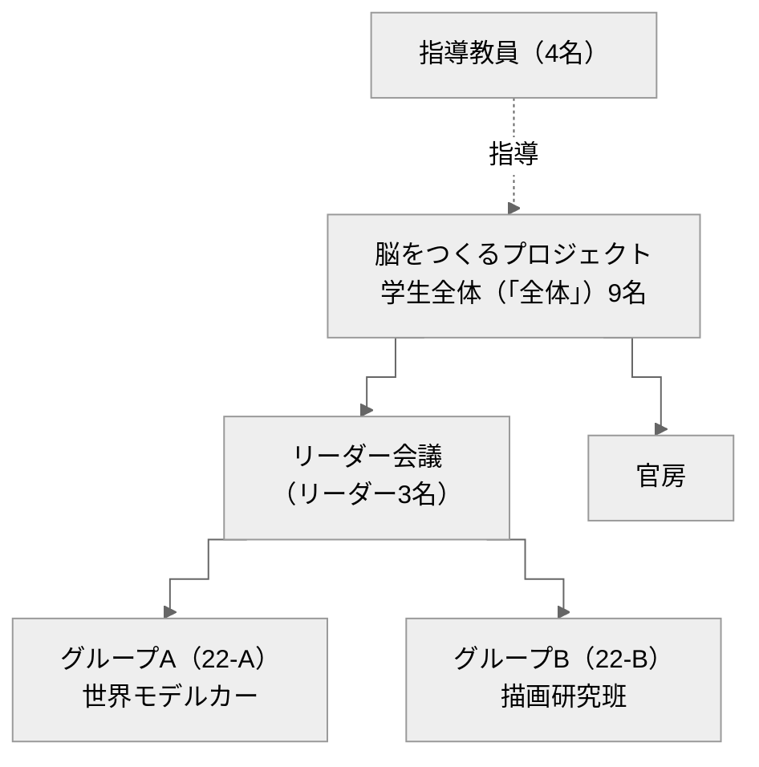
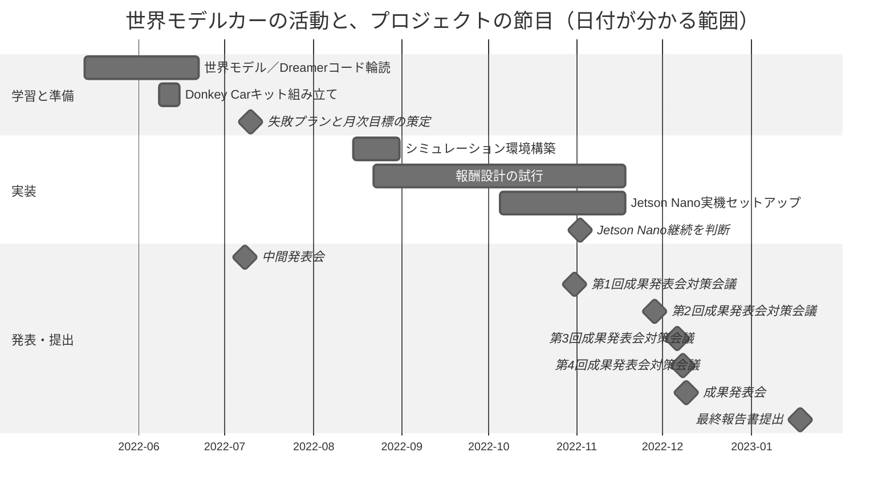

# プロジェクトについて

## 1. 概要

「脳をつくるプロジェクト」は、公立はこだて未来大学の2022年度システム情報科学実習で活動したプロジェクトです。学部3年生9名と指導教員4名で構成し、TAや外部講師を置かず、学生が最後まで独立して活動しました。

私たちは、脳と人工知能を双方向から扱いました。脳構造の工学的応用に取り組む**グループA（22-A）「世界モデルカー」**と、人工知能を用いた認知特性の説明に取り組む**グループB（22-B）「描画研究班」**の2班に分かれました。

- グループAは、世界モデルの一種であるDreamerを用いたAIカーを構築し、シミュレーション環境と実環境での自動運転に取り組みました。
- グループBは、深層学習モデルを用いて描画研究に関する心理実験の再現に取り組みました。

## 2. 組織

### 2.1 プロジェクト全体

プロジェクトリーダーは中村仁、グループAリーダーは加藤木敦也、グループBリーダーは立山雄晟が務めました。最初の1か月はリーダーをメンバー内で交代し、担当者を決めました。あわせてデザイン担当とレク担当を割り振りました。

3名のリーダーで「リーダー会議」を構成し、プロジェクト全体に置きました。リーダー会議は、基本的な方針の企画と立案、総合調整を担当しました。重要な決定を含む会議には全メンバーも参加し、意見を出せるようにしました。教員との日程調整、班同士の調整、発表会の準備も行いました。

さらに、3名のリーダーと一定の業務を分担管理する者で「官房」を構成し、プロジェクト全体の補助機関としました。官房は各種調整とアクシデント対応を想定しました。

各機関の構成と役割は次のとおりです。

| 機関 | 構成 | 位置づけと役割 |
|---|---|---|
| リーダー会議 | 中村仁（プロジェクトリーダー）・加藤木敦也（グループAリーダー）・立山雄晟（グループBリーダー） | 「全体」に設置。基本方針の企画・立案、総合調整、教員との日程調整、班同士の各種調整、発表会の準備 |
| 官房 | リーダー3名＋一定の業務を分担管理する者 | プロジェクト全体の補助機関。各種調整とアクシデント対応を想定 |
| グループA（22-A）世界モデルカー | 加藤木敦也（リーダー）・中村仁・伊藤生慈・黒岩蒼太郎・渡邉悠仁 | 世界モデルの一種であるDreamerを用いたAIカーの構築と、シミュレーション環境・実環境での自動運転 |
| グループB（22-B）描画研究班 | 立山雄晟・前澤榛人・和泉友人・池田蓮馬 | 深層学習モデルを用いた、描画研究に関する心理実験の再現 |
| 指導教員 | 香取勇一・佐々木博昭・加藤譲・ヴラジミール・リアボフ | プロジェクトの指導 |

重要な決定を含む会議には全メンバーが参加し、その意見をリーダー会議が方針決定に反映しました。

### 2.2 世界モデル班（22-A）

グループAでは、加藤木がグループリーダーを務めました。各メンバーの主な作業は次のとおりです。

| 担当者 | 主な作業 |
|---|---|
| 加藤木敦也（グループリーダー） | 活動計画・進捗管理・方針判断、作業の割り振り、中間／成果発表の準備・評価、資料・動画・会場配置、発表デモの運用（SSH 遠隔操作を試み当日は断念） |
| 中村仁（プロジェクトリーダー） | 全体組織と班方針の構築、Dreamer V1による自動運転の提案、PC・Jetson Nanoの環境構築、Nao版の統合・実機ファインチューニング、成果発表会対策会議 |
| 伊藤生慈 | 背景・目的・今後の課題、報酬計算と行動決定コードの輪読、機材選定・組み立て、PC／Jetson Nano環境構築、シミュレータ接続・サーキット製作、実機データ取得・ファインチューニング |
| 黒岩蒼太郎 | 概要、物品管理・車体組み立て、Jetson Nanoセットアップ、Jassy版の環境整備・ハードウェア実装、実機向けプログラム改変、ポスター・スライド・動画 |
| 渡邉悠仁 | 先行研究・問題・課題・到達目標、シミュレータ導入とDreamer接続、報酬設定・行動データ調整、シミュレーション学習と評価、カーキット組み立て、実機制御コード・重み変換、実機学習・発表スライド |

担当領域との対応は次のとおりです（複数人の作業は担当者を重ねています）。

| 担当者 | 班運営・計画・発表 | 世界モデル／シミュレーション | 実機・Jetson Nano・Donkey Car |
|---|---|---|---|
| 加藤木敦也 | ● | | |
| 中村仁 | ● | ● | ● |
| 伊藤生慈 | | ● | ● |
| 黒岩蒼太郎 | ● | | ● |
| 渡邉悠仁 | ● | ● | ● |

文責の分布は、黒岩が概要とJassy版、伊藤が背景・目的・前期活動・機材・今後の課題、渡邉が先行研究から到達目標までとシミュレーション領域、中村がNao版と成果発表会対策、加藤木が計画・発表・総括を主に担当しています。文責は各節の執筆担当であり、実作業の分担とは一致しません。

## 3. 組織を作った理由と結果

### 3.1 理由

私たちは、限られた時間で課題を解決するため、方針の決定と組織による実行が必要だとしました。そのために、担当業務を決めて指揮系統を確立すること、トップダウン型の意思決定を行う組織を作ること、情報共有と報告・連絡・相談の仕組みを作ることを進めました。

組織作りでは、主に日本国政府の仕組みを参考にしました。具体的には、「リーダー会議」と、補助機関である「官房」を設けました。リーダー会議は3名のリーダーで構成し、基本方針の企画・立案と総合調整を担いました。官房は3名のリーダーと一定の業務を分担管理する者で構成し、各種調整とアクシデント対応を想定しました。
トップダウンだけに限定せず、重要な決定を含む会議には全メンバーが参加し、意見を出せるようにしました。

### 3.2 結果

役割分担によって、各自が担当業務に取り組みました。リーダー会議はプロジェクト全体の司令塔となり、発表会や提出物に関する重要な会議と連絡会議を20回以上開きました。後期には製作物への着手を当初の想定より約2週間前倒しし、発表会や提出日までの時間を確保しました。

官房は、プロジェクトの続行が困難になる事案が起きなかったため、プロジェクトリーダー選出と記録に関する活動が中心となりました。

世界モデル班では、夏季休暇中に週1回のミーティングを設け、進捗と課題を共有しました。一方で、8月末以降の期限と作業を明確にできず、後期の作業量が増えました。後期開始前に複数の活動計画を立てると、作業内容と分担が明確になりましたが、終盤は作業工数に対して厳しい日程となりました。

成果発表会では、リーダー会議が企画立案と総合調整を行い、全メンバーが参加できる成果発表会対策会議を4回開きました。ただし、第4回会議では決定内容が全員に十分伝わらず、設営の遅れとリハーサル回数の減少が生じました。

## 4. 情報共有

情報共有には、主にNotionとSlackを使い、一部でDiscordとZoomも使いました。
Notionはプロジェクトの基盤として使うため、最初の1か月で整備しました。世界モデル班では、夏季休暇中の参加予定の共有にも使用しました。初期にはメンバーが使いにくい状態があり、より単純な仕組みや有料テンプレートも検討すべきでした。後半には各自がNotionを使い、過去の情報を参照するようになりました。

## 5. 変遷

作業期間と、発表・提出の節目をあわせて図に載せました。

5月に方針を決め、世界モデルとDreamerのコードを読み始めました。8月からシミュレーション環境、10月から実機のセットアップを進め、12月9日の成果発表会で実機を公開しました。

月まで確認できる活動として、6月から7月にPC環境を構築し、8月から9月にはDreamer、シミュレーション環境、実環境で使う環境の互換性を踏まえた調整を進めました。10月上旬には、シミュレータを用いた世界モデルの学習と自動走行を確認しました。成果発表会の2日前から、実環境でのファインチューニングを行いました。

2023年1月18日に最終報告書を提出しました。

