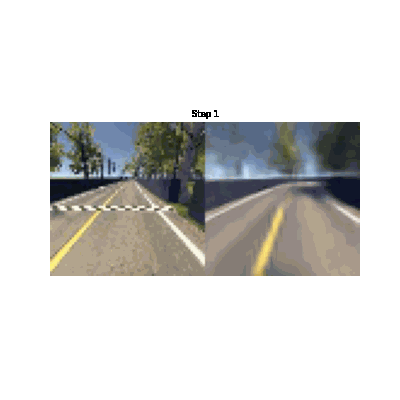
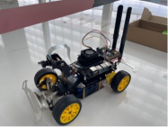
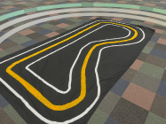
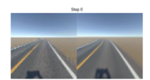
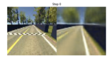
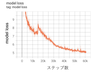
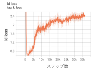

# 成果

**私たちは、観測から環境を学ぶ世界モデルの一種「Dreamer」を、小型車向け自動運転基盤「Donkey Car」に組み込み、シミュレーションと実機で自動走行させました**。

## 到達したこと、残ったこと

**到達したこと**

- DreamerをDonkey Carのシミュレータへ接続し、600エピソードの学習後に自動走行を確認しました。
- シミュレーションで学習したモデルを用いて、自作サーキット上の実機を自動走行させました。
- 実機の走行データでモデルを更新し、更新後のモデルでも走行を確認しました。
- 実機で、**直線・Lカーブ・S字カーブでの自動走行を実現しました**。当初の目的だった「自動運転を用いた世界モデルの実環境への応用」を一定のレベルで達成しました。
- **シミュレータ内の別環境へファインチューニングしたモデルでも、その環境で適切に自動走行できることを確認しました**。

**残ったこと**

- ファインチューニングを重ねた後は、シミュレーション環境で作ったモデルほどの速度は出ませんでした。カーブに対処できずコース外へ進む試行もありました。試行回数は一桁で、検証は課題として残りました。
- ファインチューニング後は約50エピソードを超えたところからKL lossが増加し、修正には至りませんでした。
- 道路は白線と黄色い中央線で構成した限定的な環境です。標識や障害物を含む道路では検証していません。

## 実機と学習結果

| 実車のオンボードカメラ | シミュレータの観測(左)とVAEによる再構成(右) |
|---|---|
|  |  |

| 実機 | 自作サーキット |
|---|---|
|  |  |

| シミュレーション学習 | ファインチューニング後 |
|---|---|
|  |  |
| 観測画像の再構成を確認しました。 | 再構成はできましたが、学習損失には課題が残りました。 |

| model loss | ファインチューニング後のKL loss |
|---|---|
|  |  |
| 学習に伴ってmodel lossが低下しました。 | 約50エピソードを超えたところからKL lossが増加しました。 |

## 実装の要点

1. Dreamer V1のコードをDonkey Carのシミュレータに接続し、観測、行動、報酬、終了フラグを取得できるようにしました。
2. 実環境でも使えるよう、画像内の線の色に基づく報酬を設定しました。
3. Jetson Nano上でカメラ、サーボモーター、DCモーターとDreamerの行動決定を統合しました。
4. 実機でデータを集め、PCでモデルを更新し、更新したモデルを実機へ戻しました。

環境構築、実行方法、コードの詳細は[リポジトリのREADME](https://github.com/jin-research/MakeBrainProject2022_WorldModelTeam)を参照してください。

## 用語

- **世界モデル**：観測から、エージェントを取り巻く環境のモデルを学習する枠組みです。
- **Dreamer**：学習した世界モデルの中で、行動と価値を学習するモデルベース強化学習手法です。
- **Donkey Car**：小型自動車向けのオープンソース自動運転プラットフォームです。
- **ファインチューニング**：学習済みモデルを別の環境のデータで追加学習することです。
