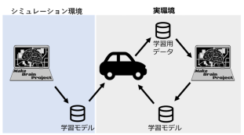

  

  

  

    
世界モデルを用いた自動運転の実現

    
私たちは、観測から環境を学ぶ世界モデルの一種「Dreamer」を、小型車向け自動運転基盤「Donkey Car」に組み込み、シミュレーションと実機で自動走行させました。背後に流れているのは、実車のオンボードカメラの映像です。

    
<a href="RESULTS">成果を見る</a><a href="https://github.com/jin-research/MakeBrainProject2022_WorldModelTeam">GitHub</a>

  

1. シミュレーション環境でDreamerを学習させ、学習モデルを実機へ移しました。
2. Donkey Carを走らせて観測データと行動データを集め、PCで学習モデルを更新しました。
3. 更新したモデルを実機へ戻す流れを繰り返し、実環境での自動走行を試しました。

## 成果の要点

- DreamerをDonkey Carのシミュレータへ接続し、600エピソードの学習後に自動走行を確認しました。
- シミュレーションで学習したモデルを用いて、自作サーキット上の実機を自動走行させました。
- 実機で、直線・Lカーブ・S字カーブでの自動走行を実現しました。

[成果の詳細（図表つき）を見る](RESULTS)

## ページ案内

  <a class="page-card" href="RESULTS"><strong>成果</strong>到達したことと残ったこと。実機と学習結果の図表、実装の要点、用語</a>
  <a class="page-card" href="ABOUT"><strong>プロジェクトについて</strong>概要、体制と担当、組織を作った理由と結果、変遷</a>
  <a class="page-card" href="ABOUT_appendix"><strong>経緯</strong>報酬設計の4版、拡張ボードまでの経路、TensorFlowからPyTorchへ</a>
  <a class="page-card" href="SETUP"><strong>環境・実行記録</strong>当時の環境の版、構築手順、詰まる箇所と対処</a>
  <a class="page-card" href="https://github.com/jin-research/MakeBrainProject2022_WorldModelTeam"><strong>コード（GitHub）</strong>ノートブック、実機コード、実行方法（README）</a>

## 資料

- [GitHubリポジトリ](https://github.com/jin-research/MakeBrainProject2022_WorldModelTeam)：環境構築、実行方法、コード
- [成果発表会スライド（SpeakerDeck）](https://speakerdeck.com/jin_nakamura/noy-wotukurupuroziekuto2022-cheng-guo-fa-biao-hui-suraido-2022nian-12yue-9ri)
- [大学公式ページ「脳をつくるプロジェクト」](https://www.fun.ac.jp/project/6159/)
- 大学公開の資料: [グループ報告書](https://www.fun.ac.jp/wp/wp-content/uploads/2022_document22_A.pdf)・[プロジェクト報告書](https://www.fun.ac.jp/wp/wp-content/uploads/2022_project22.pdf)・[ポスター](https://www.fun.ac.jp/wp/wp-content/uploads/2022_poster22_main.pdf)
- [前期のグループ報告書（本プロジェクト公開）](https://github.com/jin-research/MakeBrainProject2022_WorldModelTeam/blob/main/docs/group_report_22A_first_term.pdf)
